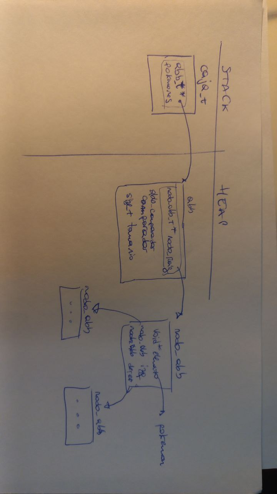
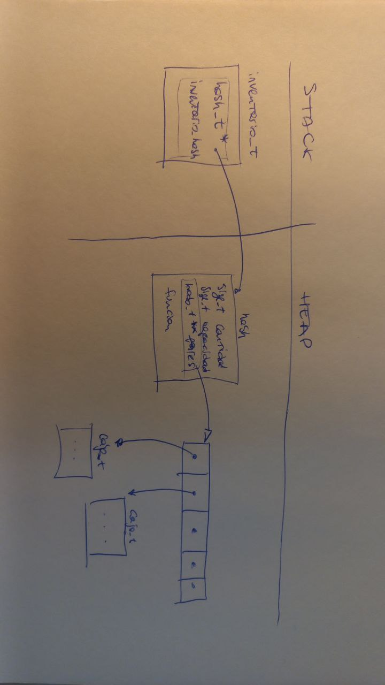

# TP2

* Alumno: Mejia Alan
* Padron: 91161

---

## Instrucciones

* Los comandos de ejecucion del codigo estan especificados en el archivo makefile.

---

## Explicación de los cambios implementados al TP1. Justificar los cambios (explicar por qué se decidió el TDA utilizado)

* Los cambios realizados en la biblioteca del TP1 mayormente se debe a la adaptacion de un tda apropiado al caso.
* Se elimino la idea de los vectores dinamicos.
* Para tal reemplazo se eligio el tda de ABB. Esto es debido a que se necestiba una busqueda rapida por pokemon, y cada vez que que se recorra se haga de forma de orden alfabetica. Esto se logra de forma INORDEN.

---

## Explicación de la implementación de cada comando pedido. Explicar cómo funcionan (y cómo utilizan el TDA Caja implementado en el TP1).

* Los comandos se desarrollaron usando las bibliotecas desarrolladas `inventario.h` y `cajas.h`.
* Se desarrollo en el main dichos comandos. Haciendo uso de las bibliotecas que tiene funcionalidades mas genericas y el desarrollador se pueda parar sobre estas y desarrollar funcionalidades mas complejas e interactuen con el usuario.

### Comando mostrar inventario

* El comando mostrar inventario esta desarrollado en la funcion `comando_mostrar_inventario`.
* Dicho comando hace uso de la funcionalidad de la funcion `inventario_con_cada_caja`. Donde se recorre el inventario, caja por caja, segun determina el hash del que esta compuesto.

### Comando cargar otra caja

* Cargar caja esta desarrollado en la funcion `comando_carga_otra_caja`.
* Esta compuesta de las funcionalidades `inventario_contiene_caja` y `inventario_cargar_caja`.
* Basicamente se consulta al usuario el nombre de la caja. Se hacen verificaciones y de pasar estas, se pasa crear la caja y luego cargarla al inventario mediante su interfaz.

### Comando combinar cajas

* El comando de combinar cajas se desarrolla en la funcion `comando_combinar_cajas`.
* Hace uso de las funcionalidades que ofrece la interfaz: `inventario_contiene_caja` para hacer diferentes chequeos a la hora de verificar las cajas fuentes y la caja destino.
* Tambien hace uso de la interfaz al elegir `inventario_combinar_cajas` para realizar la combinacion y cargarlas en el sistema.
* A su vez hace uso de la funcionalidad de la interfaz `caja.h` para poder guardar la caja combinada en un archivo, con su respectivo nombre.

### Comando mostrar caja

* Dicho comando hace uso de las funcionalidades de la interfaz: `inventario_contiene_caja` y `inventario_recorrer_caja`.
* El primero hace uso para hacer su correspondiente verificacion.
* El segundo para poder recorrer la estructura base del invetario, un hash.

### Comando buscar caja

* Dicho comando hace uso de la funcionalidad `inventario_buscar_pokemon` de la interfaz del inventario.
* AVISO: Dicha funcion deberia mejorarse, dado que por tiempo no se desarrollo apropiadamente y se hizo uso de `printf`, abriendo la puerta a que no se pueda testear correctamente dicha funcionalidad de la biblioteca `inventario.h`.

### Comando Salir

* Simplemente hace salir al programa del bucle que el usuario.
* Una vez que sale de tal bucle, se limpia toda la memoria.

---

## Diagramas que sirvan para entender cómo funciona tu programa (por favor, los diagramas se intercalan con la explicación, no se ponen al fondo de todo desconectado de todo el resto).

### Inventario hace uso del tda HASH

* Como se explico anteriormente, la biblioteca de caja se reemplazo los vectores dinamicos por un tda abb.
* Como se peude observar, la estructura caja tiene un campo pokemones del tipo abb. Luego cada raiz guardara como elemento un pokemon.
* 
<!-- *  -->

### Cajas hace uso del tda ABB

* El sistema de gestion de cajas, llamado inventario, esta desarrollado con un tda HASH. Esto se debe a las nececidades de rapido acceso a traves de una clave, el nombre de la caja.
* Como se observa en la imagen, el inventario posee un solo campo llamado inventario_hash. Este apunta a un hash. Debido a que es un hash de direccionamineto cerrado, se guarda un vector dinamico de puntero para colisionar en nodos. Estos nodos guardaran las cajas.
* 
<!-- *  -->